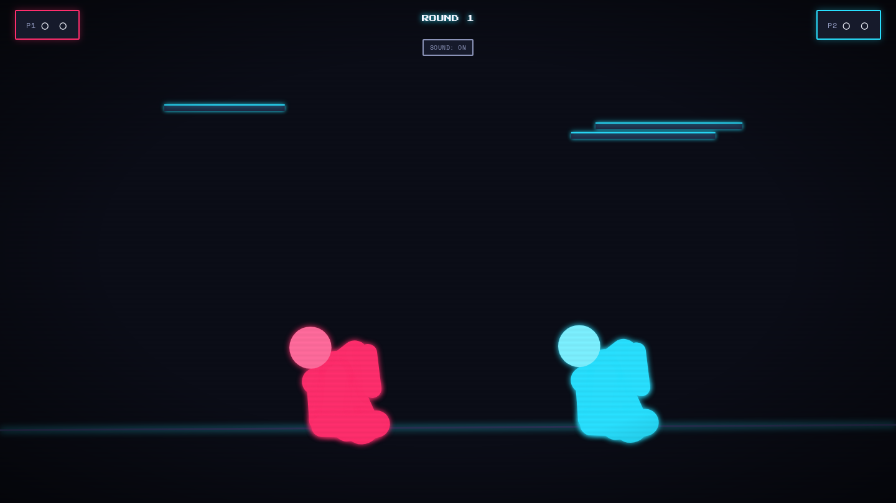

# Ragdoll Rumble

**▶ Play it live: [apps.charliekrug.com/ragdoll-rumble](https://apps.charliekrug.com/ragdoll-rumble/)**

[](https://github.com/ctkrug/ragdoll-rumble/actions/workflows/ci.yml)
[](LICENSE)

Two-player ragdoll brawls, right in your browser. Grab a friend, share a keyboard, and knock
each other's wobbly ragdolls off the arena. The engine underneath is built from scratch: no
Box2D, no Matter.js, no physics library at all.



## What it is

- **Two players, one keyboard.** Player 1 punches, kicks, and lunges on `F`, `G`, `H`; Player 2
  answers on `/`, `.`, `,`. No split screen, no second controller, no setup.
- **Physics you can feel.** Every limb is a real point mass held together by hand-tuned
  constraints, so a solid hit sends a ragdoll flailing, stumbling, and tipping over the edge
  instead of playing a canned animation.
- **A fresh arena every round.** Floors tilt and platforms shuffle from a random seed, so no two
  rounds play out the same way, and a given seed reproduces one exactly.
- **It hits back.** A landed blow fires a screen shake, an impact flash, a brief freeze-frame, and
  a synthesized sound effect. Winning the match lands a rotating K.O. stamp, a stats card, and a
  particle burst.
- **Plays on your phone.** On a narrow screen the keyboard controls become on-screen Punch, Kick,
  and Lunge buttons for each player.

## Play

Open the [live version](https://apps.charliekrug.com/ragdoll-rumble/) (or run `npm run dev`). Two
players share the keyboard:

| Action | Player 1 | Player 2 |
| ------ | -------- | -------- |
| Punch  | `F`      | `/`      |
| Kick   | `G`      | `.`      |
| Lunge  | `H`      | `,`      |

When the countdown clears and `FIGHT` appears, you take control. Win a round by knocking your
opponent off the arena or pinning them flat on their back for about a second. First to two round
wins takes the match. Hit Rematch, or throw any attack, to run it back. On a phone, tap the
on-screen buttons instead.

## How it's built

There is no physics library here. The solver is written from scratch in TypeScript:

- **Verlet integration** moves every point under gravity, keeping velocity implicit (current
  position minus previous position) so constraint satisfaction is a plain positional correction
  rather than a force accumulator.
- **Distance and angle constraints** are relaxed over several passes each frame to hold limbs
  together and stop elbows and knees from bending backward.
- **Ragdoll-vs-ragdoll collision** resolves inside that same relaxation loop, not once after it,
  which is what keeps a tangle of limbs from pumping energy into itself and exploding off-screen.
- **A fixed-timestep accumulator** decouples the simulation from the display refresh rate, so the
  physics stays stable at any frame rate.

The whole game is a single static build with no server, and the physics core (points, constraints,
solver stability, capsule collision) ships with its own unit tests. See
[`docs/VISION.md`](docs/VISION.md) for the rationale and [`docs/ARCHITECTURE.md`](docs/ARCHITECTURE.md)
for a map of the code.

## Develop

```sh
npm install
npm run dev         # local dev server with hot reload
npm test            # run the unit test suite (vitest)
npm run typecheck   # tsc --noEmit
npm run lint        # eslint
npm run format      # prettier --check
npm run build       # produce a static dist/ build
```

The build outputs a single relocatable `dist/` with only relative asset paths, so it can be hosted
from any subpath.

## Stack

TypeScript and the Canvas 2D API for the engine and rendering (no framework, no runtime
dependency), Vite for the dev server and static build, Vitest for the test suite, and GitHub
Actions for CI (format, lint, typecheck, test, build) on every push.

## License

[MIT](LICENSE) © Charlie Krug

More of Charlie's projects → [apps.charliekrug.com](https://apps.charliekrug.com)
